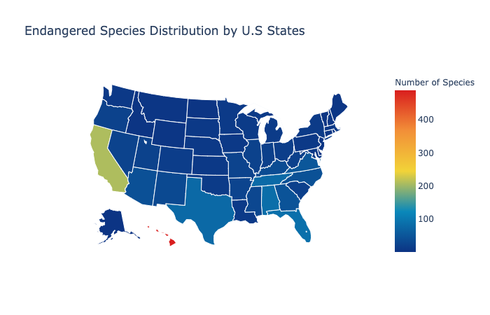
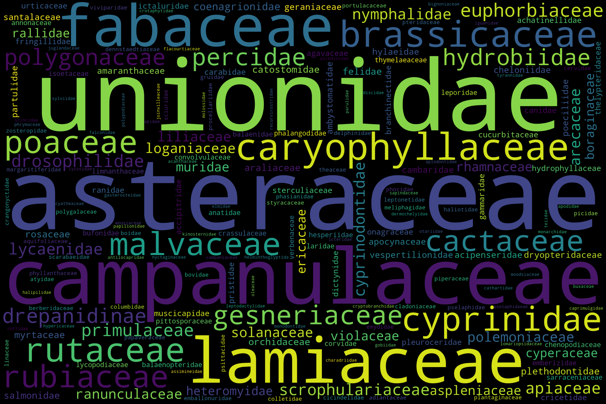
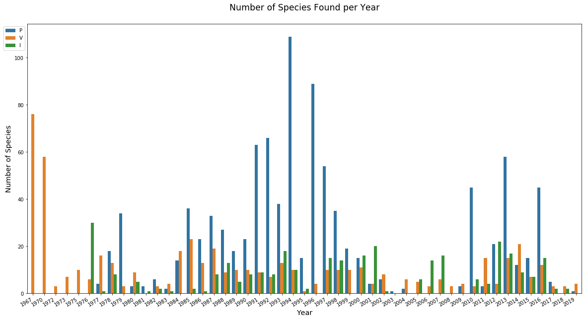

# Data Mining on the United States Wildlife

Welcome!
This is my individual project 3 for my data mining class. In this project, I will do some data mining and analysis about the United States Wildlife. 
The programming language I use is Python with supports from plotly.

---

# Introduction

The ecosystem in our planet is getting worse day by day. Not only the environmental change but also the extinction of many species result in detrimental effects to the ecosystem. Many people are not aware of the importance of wildlife since they think animals and plants have no influence on their lives. However, in fact, wildlife plays a key role in improving the quality of human life. For example, a variety of wildlife species can promote the biodiversity which benefits human health and maintains ecosystem's functionality. Furthermore, many medicines that address popular health issues such disorders and heart diseases are the productions of chemicals from plants and animals.

Since many species are at risk of extinction, it is extremely important to have appropriate conservation plans to protect our planet's ecosystem.

This project presents data mining on United States Wildlife to identify which regions need to be prioritized in conservation. In addition, the most endangered species family will be mentioned to understand which plants and animals should be the targets of protection.

---
# Contents

## Scraping the data

In this section, I scrape my data from [U.S Wildlife & Fish Service website](https://www.fws.gov/).

The data is retrieved from [the search page](https://ecos.fws.gov/ecp0/reports/ad-hoc-species-report-input).

There is a problem that the url does not change when I selection more attributes for the table. Fortunately, I figured out a solution for this. More details are provided in my scraping notebook below.

[Scraping Process](https://hieu2695.github.io/U.S-Wildlife/html/ScrapingProcess.html)

## Data Preprocessing

In this part, I clean my data for better usage. 
There are two main things I want to do:
1. Extract the U.S state codes and remove any description in the Region column.
2. Extract the Year in the First Listed Date column.
There are some minor issues with other columns which are also managed in this step.

[Data Preprocessing](https://hieu2695.github.io/U.S-Wildlife/html/PreprocessingData.html)

## Data Analysis

[Data Analysis](https://hieu2695.github.io/U.S-Wildlife/html/Analysis.html)

This project does data analysis about two main aspects. 

At first, I figure out the U.S states with most endangered species. From the below graph, we can see that Hawaii and California are two states with highest number of species. Therefore, there should be wildlife conservation priorities on these areas.

The next thing is to identify the species family that is at risk of extinction. I do some statistics about the families with most number of endangered species and figure out that Asteraceae is the plant families with most endagered species. 

The animal families with most endangered species are Unionidae (a family of mussels), Cyprinidae (a family of freshwater fishes) and Hydrobiidae (a family of snails). These three animal classes are often the target of fishers since they provide many ingredients for human and are favorite resources in restaurants :).

I aslo create some graphs to see about the new discovered species in the United States in recent four decades. In general, during 1970s, there were many vertebrate species found in the United States. From the end of 1970s to 2000, more flowering plants species were found and successfully grown in the USA. In recent years, there have been fewer species discovered and most of them are animals.

# Key Findings

After data mining on U.S Wildlife, I want to conclude two main things. Hawaii and California are the two states with highest number of endangered species so there should be high priority on preserving the wildlife in these areas. Furthermore, we need more regulations on fishing to prevent some endangered families such as Unionidae (mussels), Hydrobiidae (snails) and Cyprinidae (freshwater fishes) from extinction and maintain the underwater ecosystem.

